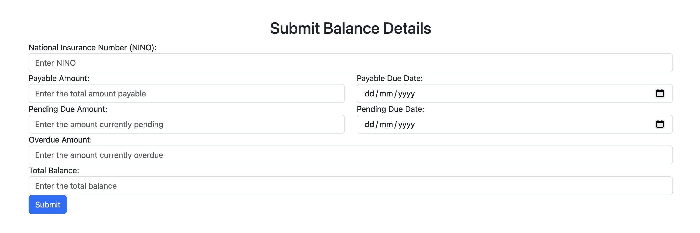

# SA Liabilities Sandpit Stubs

The SA Liabilities Sandpit Stubs provides a set of stubbed services and APIs for testing and development purposes 
related to Self-Assessment (SA) liabilities. This sandbox mimics real-world interactions, 
allowing developers to test their applications in a controlled environment.

# Prerequisites
- Java 11+
- SBT (Scala Build Tool)

# Running the Application locally
1) Clone the repository:
```bash
git clone https://github.com/hmrc/sa-liabilities-sandpit-stubs.git
cd sa-liabilities-sandpit-stubs
```
2) Compile the code:
```bash
sbt compile
```
3) Run the service:
```bash
sbt run
```
The service will start on port `9900` by default.


# Endpoints Overview

### Stub
|   Method   |       Path       | Description                                                  | 
|:----------:|:----------------:|:-------------------------------------------------------------|
|  **GET**   | _/balance/:nino_ | Retrieves balance details for a specific NINO.               |
|  **PUT**   | _/balance/:nino_ | Saves a new balance detail for a specific NINO.              | 
|  **POST**  | _/balance/:nino_ | Saves a generated balance detail for a specific NINO.        | 
| **DELETE** | _/balance/:nino_ | Deletes the balance details associated with a specific NINO. | 
| **PATCH**  | _/balance/:nino_ | Replaces existing balance details for a specific NINO.       | 

### Wizard
##### The form
This form allows you to enter and submit your balance details. You'll need to provide information such as your NINO, the amount due, due dates, and any outstanding balances.


| Method |      Path      | Description                                                             | 
|:------:|:--------------:|-------------------------------------------------------------------------|
|  **GET**   |    _/stub_     | The HTML form which lets you enter and submit your balance.             | 
|  **POST**  | _/stub/submit_ | The HTML form which allows you to submit your balance details for stub. |

1) `POST /balance/:nino` - Saves balance information for a specified user.

Path Parameters:
- nino
  Request Payload:
    ```json
     {
        "totalBalance": 22777,
        "pendingDueDate": "2024-11-29",
        "pendingDueAmount": 7502,
        "payableAmount": 7182,
        "overdueAmount": 8093,
        "payableDueDate": "2025-02-24"
      }
    ```

Response:
```json
{
"status": "Balance updated successfully"
}
```

### Automatic Payload Generation with `X-USE-STRATEGY` Header
When interacting with the Stub, you can skip providing a request payload and let the service automatically generate it.
This can be achieved by using the `X-USE-STRATEGY` header in your API request.
The header supports two specific strategies:
- `randomize`,
- `faker`,

which guide the service in generating appropriate mock data based on predefined rules.

### How It Works
* Header: `X-USE-STRATEGY`
* Supported Values:
    - `randomize` - Generates random, realistic payload data for the specified request.
    - `faker`: Uses a library to produce simulated but valid data for fields such as names, addresses, and other attributes

When the header is used, the service will automatically assign the generated data to the requested NINO.

### Differences Between randomize and faker
- `randomize`: Generates random values for each field, often based on valid ranges or formats relevant to the domain.
- `faker`: Creates more natural, contextually accurate data (e.g., realistic names, addresses, or dates).

2) `GET /balance/:nino` - Fetches balance for a user identified by their NINO.

Path Parameters:
- nino

Response
- Success(200 OK):
    ```json
    {
      "totalBalance": 15462,
      "pendingDueDate": "2024-10-19",
      "pendingDueAmount": 1793,
      "payableAmount": 9447,
      "overdueAmount": 4222,
      "payableDueDate": "2024-10-06"
    }
    ```
- Failure(404 Not Found):
    ```json
    {
      "error": "No balance found"
    }
    ```

### Configuration
#### Random Control:`generator.random.seed`
Is used to control the random number generation in stub that involve any form of randomness.
In out context, the seed is essential for making sure the same sequence of "random" data is generated when the same seed is used.
#### Purpose:
- `Reproducibility`: By setting the seed, the random number generator produces a consistent sequence of random numbers.
  This is crucial for testing and debugging, allowing developers to recreate specific scenarios by re-running code with the same seed.
- `Consistency`: In an environment, using the same seed will generate identical payloads each time a strategy is applied.
  This is helpful when verifying the service's behavior across multiple test runs.
- `Controlled Randomness`: Seeding ensures controlled randomness. Instead of generating unpredictable data every time, a set seed helps create randomness in a predictable, repeatable manner.

#### Time Control:`generator.time`
We currently support two modes for generating time data: `Fake` and `Live`. These modes determine how the service generates timestamps, dates, and other time-related data used in simulations or test scenarios
1. `Fake Mode`
   The time data is a constant value provided by the user. This allows developers to simulate specific moments in time, such as testing events that happen at a specific date (e.g., a future or a historical date).
   Useful when you want the service to simulate a predefined date, such as testing how the service behaves on a particular tax due date.
2. `Live Mode`
   The service uses the real, current system time. All time-related data generated by the service reflects the actual current date and time.
   Useful for real-time testing scenarios where the system behavior needs to match the current date and time, ensuring that deadlines or other time-sensitive data are aligned with real-world conditions.

##### Both modes are helpful for different testing scenarios:
- Fake Mode is ideal when you need consistency or wish to simulate the system behavior on a particular date in the future or past.
- Live Mode is better for real-time interactions where the system’s response depends on the actual current date.


#### Data Control:`generator.default`
Similar to `generator.time`, the Stub service also supports two modes for `generator.default`, which controls the behavior of default data generation. These modes are:
- `Fake`,
- `Live`

which allow the system to generate realistic or controlled default values for various data fields, depending on your testing needs.
1. `Fake Mode` - values are static and pre-defined by the user. This allows developers to use specific, consistent data across test runs, ensuring that the generated values remain constant.
   This mode is ideal when you need reproducible results or want to test the system behavior with controlled, predictable data.
2. `Live Mode` - the system generates dynamic default values that reflect real-world, current conditions. For example, the service may generate unique data or other identifiers based on actual system conditions.
   This mode is suitable for tests where you want the system to behave as it would in a live, generating fresh and realistic data for every request.

##### Both modes are helpful for different testing scenarios:
- Fake Mode: Useful when consistent, repeatable data is required for debugging or verifying functionality over multiple test runs.
- Live Mode: Suitable for real-world scenario testing, where the generated data needs to reflect current, dynamic conditions.


#### Feature Control: `feature-toggles`
The feature-toggle allows developers to enable or disable certain functionalities in a system without changing the codebase or redeploying the application.
They provide a way to control feature rollouts, enabling safe testing and gradual deployment of new features.

#### Feature: Bearer Token Validation `new-auth-check-enabled`
```hocon
feature-toggles {
  new-auth-check-enabled = true
}
```


enables an authentication check mechanism within the system.

If the feature toggle `new-auth-check-enabled` is set to `true`, the system enforces a check to ensure that a valid Bearer token is included in the Authorization header of all incoming requests.
This enhances security by requiring proper authentication before accessing protected resources.
To Disable Check: set the toggle to `false`, the system does not require a Bearer token, allowing requests to proceed without performing this additional layer of authentication.
This might be useful during development or when testing features that do not yet require secure authentication

#### When Enabled (true):
- The system checks if a valid Bearer token is present in the request headers.
- Requests without a Bearer token or with an invalid token will be rejected with an appropriate error, such as 400 Bad Request and payload:
    ```json
    {
      "error": "Missing Authorization Header"
    }
    ```
#### When Disabled (false):
- The Bearer token check is bypassed, allowing requests without authentication to access the system's resources.


#### Request Validation: Fields
The SA Stubs service includes a flexible validation system for incoming API requests,
which allows you to enforce specific rules on the payload data.
This ensures that only valid and expected data is processed,
improving reliability and catching errors early.

#### Configuration
The configuration enables request validation for balance-related fields
and specifies which fields in the request must be validated.
```hocon
validation {
    balance {
        enable = true
        fields = ["pendingDueAmount", "overdueAmount", "payableAmount"]
    }
}
```

####  How It Works
- Enable Validation (`enable = true`): When set to true,
  the system performs validation checks on the incoming request payload.
  This ensures that the specified fields are present and meet certain criteria,
  such as format, data type, or value constraints.
- Fields to Validate (`fields = [...]`):  The fields array lists the specific balance-related
  fields that must be validated in the request.
  In this case, the fields `pendingDueAmount`, `overdueAmount`, and `payableAmount` are subject to validation.

### License

This code is open source software licensed under the [Apache 2.0 License]("http://www.apache.org/licenses/LICENSE-2.0.html").